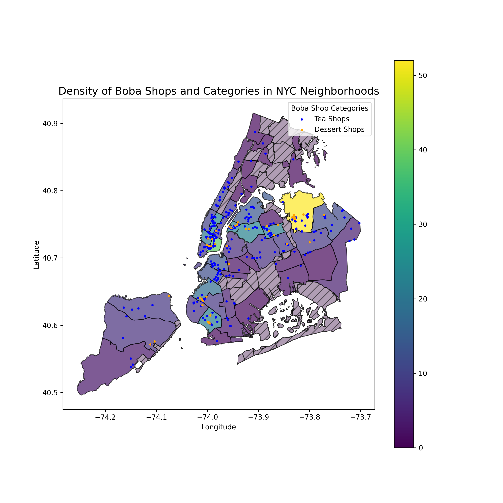

# NYC Boba Map!

## Overview
My project explores boba shops in NYC, visualizing the density of shops per community district, and the median income of areas with boba shops. This includes:
- Two static maps with median income and density infomration
- One interactive map filtered by ratings, coupled with price and location information.

## Dataset Information:
- *missing link for github repo*
- *missing link for median income data*
- *missing lihk for NYC geojson*

## Static Maps
1. Boba shop locations and district median incomes
   
2. Boba shop locations and density per district
   

## Interactive Map
<iframe src="boba_nyc_map.html" width="100%" height="800px"></iframe>
