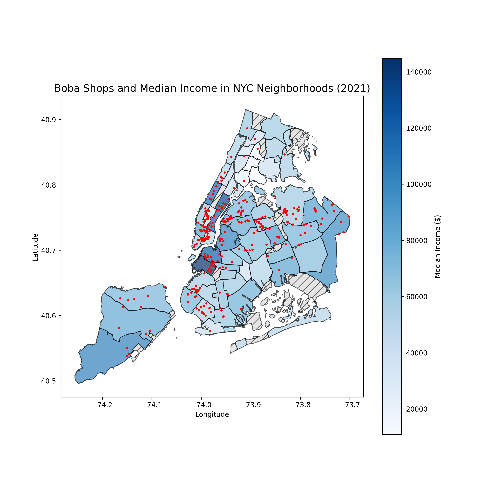

# NYC Boba Map!

## Overview
My project explores boba shops in NYC, visualizing the density of shops per community district, and the median income of areas with boba shops. This includes:
- Two static maps with median income and density infomration
- One interactive map filtered by ratings, coupled with price and location information.

## Dataset Information:
- [mebauer/boba-nyc repo](https://github.com/mebauer/boba-nyc) This was last updated 2022.
- [CCCNY Median Income Data](https://data.cccnewyork.org/data/map/66/median-incomes#66/39/3/107/127/a/a) This data is for 2021 medain incomes
- [NYC Open Data CD Borders](https://data.cityofnewyork.us/City-Government/Community-Districts/yfnk-k7r4) I don't know when this was last updated

## Static Maps
1. Boba shop locations and district median incomes
   
2. Boba shop locations and density per district
   

## Interactive Map
<iframe src="boba_nyc_map.html" width="100%" height="800px"></iframe>

### Author
- Edward Yin
- Command-Line GIS, Fall 2024
